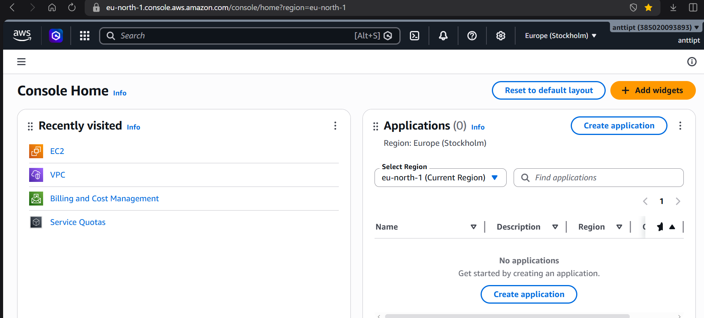
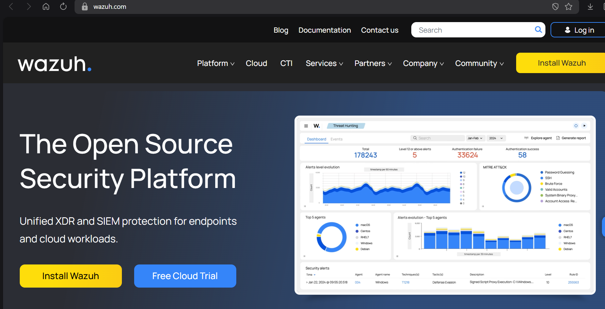
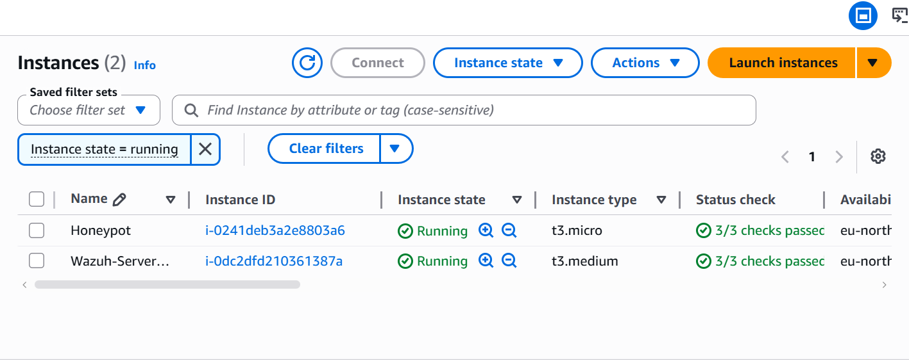
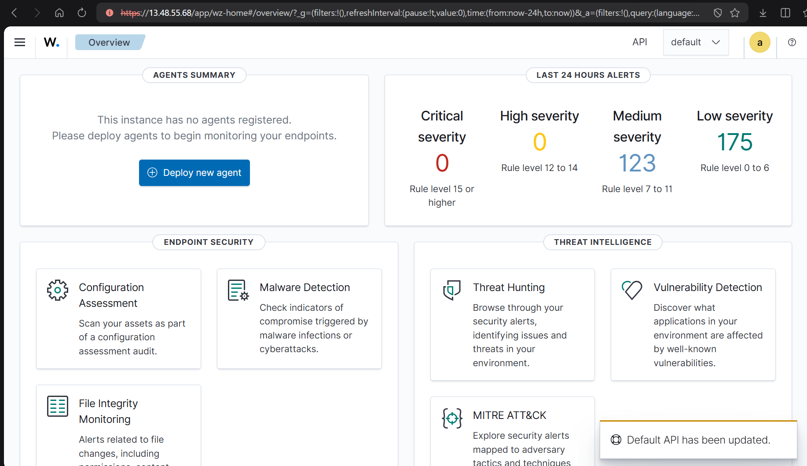
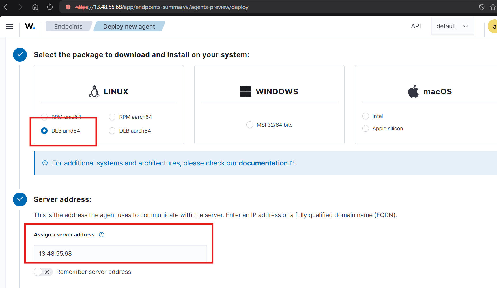
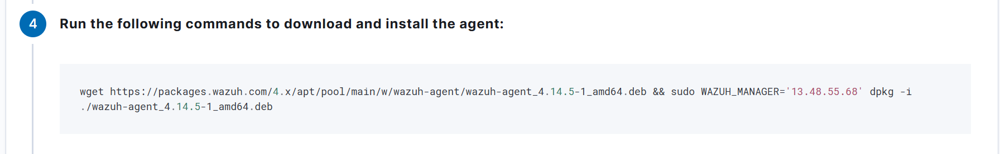
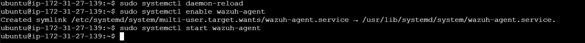
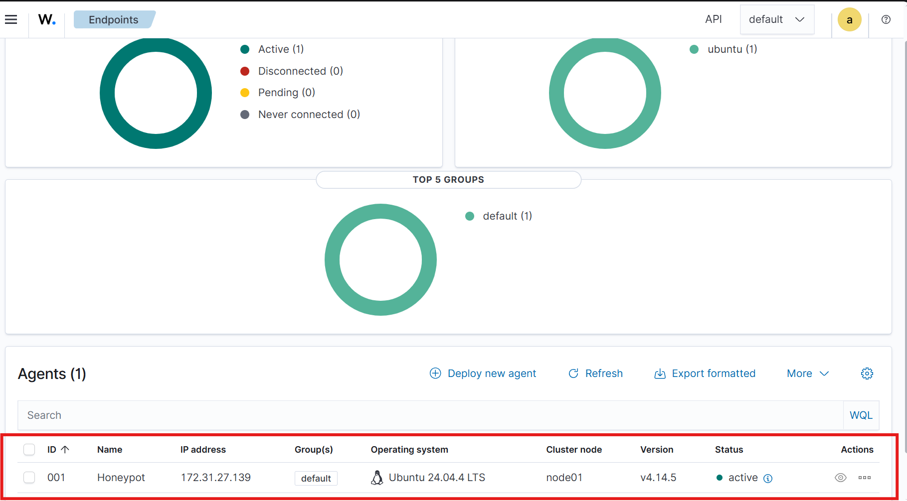

## Honeypot-projekti

Projektin tavoitteena on pystyttää pilviympäristöön "hunajapurkki" (honeypot), 
joka houkuttelee hyökkääjiä, kerätä heidän toiminnastaan lokitietoa ja visualisoida
hyökkäykset SIEM-järjestelmässä (Security Information and Event Management).

## Projektin osat

- Pilvipalvelu: AWS (Paid Plan, sillä ilmaisessa versiossa ei ollut tarpeeksi isomuistista 
konetta tarjolla)

- SIEM: Wazuh (ilmainen, avoimen lähdekoodin standardi).

- Käyttöjärjestelmä: 2 x Linux/UNIX - aws-instanssia (instances) (Honeypot ja Wazuh-Server-Uusi)

- Analyysi: Palomuurin lokit, SSH-lokit.

Projektin vaiheittainen toteutus

Vaihe 1: Infrastruktuurin pystytys
tulossa...

## Vaihe 2: SIEM-integraatio ja seuranta
kuvatekstit tulossa

Vaihe 3: Hyökkäyksen simulointi
tulossa...

Vaihe 4: Analyysi ja dokumentaatio

## Haasteet

Haasteita oli aws:n instanssien security group-asetuksissa. Laitoin aluksi väärän IP-osoitteen
Wazuh Serverin security groupin Custom TCP porttiin 1514. Kun korjasin oikean IP:n eli 
Honeypotin IP-osoitteen porttiin sain instanssin yhdistettyä nettiin. Lisäksi Honeypotin 
security group-asetukset olivat jostain syystä kadonneet edellisen kerran jälkeen, lisäsin
asetukset uudestaan jonka jälkeen yhdistäminen verkkoon onnistui.

Minulla oli aluksi väärä nettiosoite Wazuhin asennus-skriptissä. Tarkistin oikean osoitteen
Wazuhin nettisivujen dokumentaatiosta jonka jälkeen assennus onnistui. 

Arkkitehtuurikaavio // tulossa

Kuvakaappaukset // tulossa

Havainnot // tulossa

